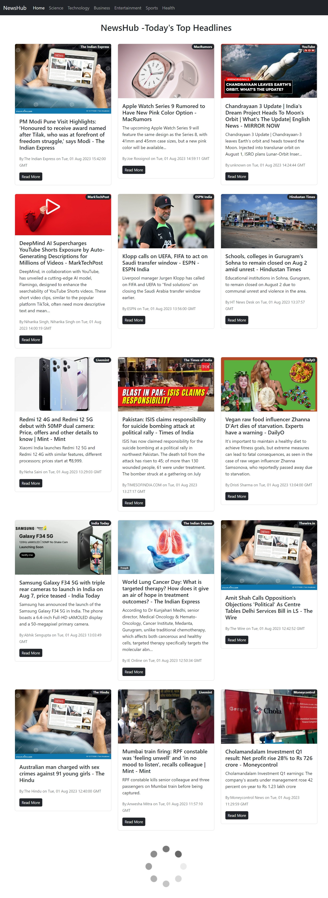

# NewsHub | Interactive News Website
# 🎓Overview
NewsHub is a web application that provides users with the latest news from around the world. The app utilizes the NewsAPI to gather news articles from a variety of reputable sources and presents them to users in an easy-to-use interface. One of the key features of NewsHub is its advanced filtering options, which allow users to sort news articles by category, such as sports, entertainment, politics, and more. The app also incorporates infinite scrolling functionality, which enables users to seamlessly browse through a virtually endless stream of news articles without interruption.

# Screenshots

- 🌝 **Top Loading Bar:**

# Key Features
React Class-Based and Function-Based Components: The project is developed using both React class-based components as well as react-function based component, providing a solid foundation for managing state and behavior.

React Router: Implemented React Router to facilitate smooth navigation and enable users to access news from different categories effortlessly.

componentDidMount: Utilized componentDidMount lifecycle method to fetch data and ensure that news articles are loaded efficiently when the component mounts.

Infinite Scroll: Incorporated Infinite Scroll functionality to enhance the user experience by loading additional news articles as the user scrolls down the page.

PropTypes and Default Props: Used PropTypes and Default Props to ensure the correct data types and default values for components, thus enhancing code reliability.

Async Await: Employed async await to fetch data from the News API, making the process of fetching and handling data more streamlined and readable.
